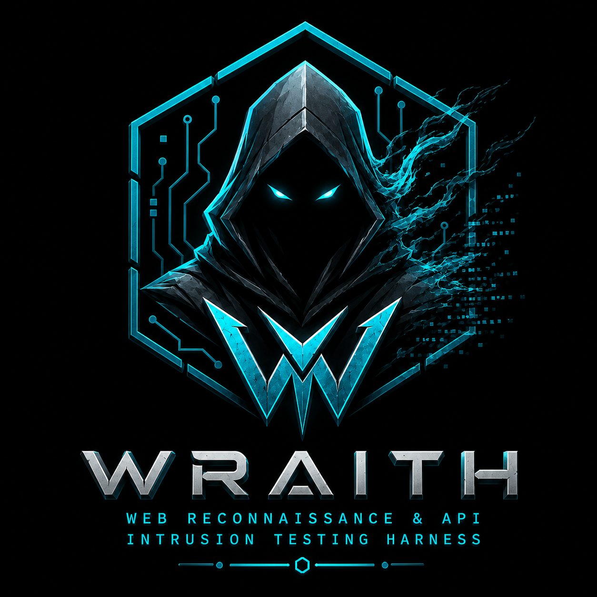

<div align="center">

<!-- ═══════════════════════════════════════════ -->
<!--           REPLACE WITH YOUR LOGO           -->
<!--           -->
<!-- ═══════════════════════════════════════════ -->


# WRAITH
### Web Reconnaissance & API Intrusion Testing Harness

[](https://python.org)
[](https://fastapi.tiangolo.com)
[](LICENSE)
[](https://owasp.org/API-Security/)
[](https://wraith-t5sl.onrender.com)

### 🔗 [wraith-t5sl.onrender.com](https://wraith-t5sl.onrender.com)

> **For authorized security testing only.**  
> WRAITH automates common API vulnerability discovery with real-time streaming results and a professional hacking dashboard.

</div>

---

## UI Preview

<!-- ═══════════════════════════════════════════════════════════ -->
<!--                ADD YOUR SCREENSHOTS BELOW                  -->
<!--  Replace the placeholder blocks with actual image paths    -->
<!-- ═══════════════════════════════════════════════════════════ -->

<div align="center">

### Dashboard

```
```


```
```
</div>

---

## What is WRAITH?

WRAITH is an automated **API security scanner** built with a FastAPI backend and a single-page dark-theme dashboard. It hunts for the most critical API vulnerabilities defined in the **OWASP API Security Top 10**, streaming results live to the browser as each finding is discovered — no page reloads, no waiting.

It was built to give security researchers, pentesters, and bug bounty hunters a fast, visual way to probe REST APIs for common weaknesses without writing custom scripts for every engagement.

---

## Features

- **Live Streaming** — findings appear in real time via Server-Sent Events (SSE)
- **4 Attack Modules** — IDOR, Broken Auth, JWT Attacks, Rate Limiting
- **CVSS Scoring** — every finding includes a severity score
- **Raw HTTP Viewer** — inspect exact request/response pairs per finding
- **Vulnerability Breakdown** — radar chart + severity distribution chart
- **Scan History** — previous scans stored in-session on the sidebar
- **Export** — download results as JSON or PDF report
- **Docker Ready** — single command to spin up

---

## Vulnerability Modules

| Module | What It Tests | OWASP Reference |
|--------|--------------|-----------------|
| **IDOR / BOLA** | Sequential ID enumeration, unauthenticated resource access, cross-user object access | [API1:2023](https://owasp.org/API-Security/editions/2023/en/0xa1-broken-object-level-authorization/) |
| **Broken Auth** | Missing/empty/malformed tokens, expired tokens, auth bypass, cross-user access | [API2:2023](https://owasp.org/API-Security/editions/2023/en/0xa2-broken-authentication/) |
| **JWT Attacks** | Algorithm:none attack, weak secret brute-force, expired token reuse, signature stripping | [API2:2023](https://owasp.org/API-Security/editions/2023/en/0xa2-broken-authentication/) |
| **Rate Limiting** | 50-request burst test, 429 detection, rate-limit header inspection, endpoint flooding | [API4:2023](https://owasp.org/API-Security/editions/2023/en/0xa4-unrestricted-resource-consumption/) |

---

## Tech Stack

| Layer | Technology |
|-------|-----------|
| Backend | FastAPI + Uvicorn |
| Streaming | Server-Sent Events (SSE) |
| Scanner Modules | Python + Requests + PyJWT |
| Frontend | Vanilla JS + Tailwind CSS (CDN) |
| Charts | HTML5 Canvas (radar + line charts) |
| Export | ReportLab (PDF) + JSON |
| Container | Docker |

---

## Installation

### Local

```bash
git clone https://github.com/Hamza-Shaukat078/WRAITH.git
cd WRAITH
pip install -r requirements.txt
python main.py
```

Open [http://localhost:8000](http://localhost:8000)

### Docker

```bash
docker build -t wraith .
docker run -p 8000:8000 wraith
```

---

## Usage

1. Enter the **Target URL** — e.g. `https://api.target.com/v1`
2. Select **Auth Type** and paste your **Bearer Token** (optional)
3. Toggle the **scan modules** you want to run
4. Click **Initiate Hunt** — results stream live in the dashboard
5. Click any finding to inspect the raw **HTTP request/response**
6. Export the full report as **JSON** or **PDF** when complete

---

## Legal Targets for Testing

WRAITH should only be used against systems you own or have explicit written permission to test. Recommended practice targets:

```bash
# OWASP Juice Shop — best match for WRAITH's API modules
docker run -p 3000:3000 bkimminich/juice-shop

# Point WRAITH at: http://localhost:3000
```

Other legal targets: [DVWA](https://github.com/digininja/DVWA), [WebGoat](https://github.com/WebGoat/WebGoat), [HackTheBox](https://hackthebox.com), [PortSwigger Labs](https://portswigger.net/web-security)

---

## Project Structure

```
WRAITH/
├── main.py                 # FastAPI app, SSE endpoint, export routes
├── scanner/
│   ├── __init__.py         # Module registry
│   ├── idor.py             # IDOR / BOLA checks
│   ├── broken_auth.py      # Broken authentication checks
│   ├── jwt_check.py        # JWT attack checks
│   ├── rate_limit.py       # Rate limiting checks
│   └── capture.py          # HTTP capture helper
├── templates/
│   └── index.html          # Full dashboard (CSS + JS inline)
├── logo.png
├── requirements.txt
└── Dockerfile
```

---

## Disclaimer

This tool is intended **exclusively for use on systems you own or have explicit written authorization to test**. Unauthorized security testing is illegal under the Computer Fraud and Abuse Act (CFAA), the Computer Misuse Act, and equivalent laws worldwide. The author accepts no liability for misuse of this tool.

---

<div align="center">

Built for the security community &nbsp;|&nbsp; OWASP API Security Top 10

</div>
